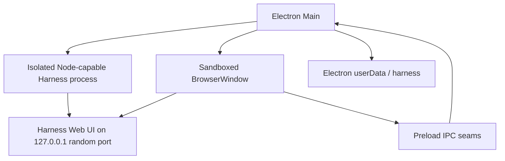

# Casleo architecture

Casleo is an Electron host for the existing DeepSeek Harness runtime and Web UI. It does not maintain a second agent runtime or reimplement the Harness frontend.

## Runtime topology



On macOS, Harness runs in an Electron UtilityProcess with Node capabilities. On Windows, it is launched with the bundled target-native Node.js executable. Cordis HMR's `--expose-internals` permission is granted to that isolated process and never to the web renderer.

## Startup flow

1. Configure a stable production or development application identity and user-data directory.
2. Acquire the single-instance lock.
3. Create the application-owned `launch-root` directory.
4. Open the startup surface and inspect the normal web profile.
5. Pin the profile's pnpm store and repair incomplete package state when needed.
6. Start Harness on an available `127.0.0.1` port with the tracked desktop patch layer.
7. Poll the endpoint until it remains healthy, then load it into the main window.

Harness restarts reuse the same application-owned data. Safe Mode starts a separate profile containing official core bundles while leaving normal-profile plugins blocked.

## Persistent data

```text
Electron userData/
├── launch-root/                 Neutral Harness process working directory
├── harness/                     DSH_HOME
│   ├── profiles/                Normal and Safe Mode profiles
│   ├── sessions/                Conversation state
│   ├── settings.yaml            Harness-backed settings
│   └── plugins and package data
└── bin/                         Cached desktop helper binaries

Electron logs/
└── harness.log                  Desktop and Harness startup diagnostics
```

Production and development builds use separate user-data roots. Application upgrades do not replace profile, plugin, workspace, session, or model configuration data.

## Window and IPC security

The main Harness window uses:

- `contextIsolation: true`
- `nodeIntegration: false`
- Electron renderer sandboxing
- web security enabled
- blocked webviews
- navigation and new-window restrictions
- a narrow permission allowlist

Only local Harness, packaged file, and desktop recovery URLs are trusted inside the app. Ordinary HTTP and HTTPS links are opened externally. IPC handlers validate the sending window and main frame before performing privileged actions such as opening the native directory picker, restarting Harness, or managing Safe Mode.

## Profiles and plugin recovery

The normal web profile may contain community plugins and their transitive packages. Startup performs bounded consistency checks and can repair incomplete package operations before launching Harness.

When a plugin prevents startup or frontend rendering, the recovery path collects log and renderer evidence, resolves ownership through the profile manifest, lockfile, bundles, loader entry IDs, slot conflicts, dependencies, and Cordis patch rows, then offers a targeted action. Destructive profile changes require an explicit user action.

Safe Mode is non-destructive: it starts an isolated official-core profile, keeps the Agent and user data available, and allows the user to remove selected third-party plugins before returning to the normal profile.

## Desktop customization boundary

Most of the product UI remains upstream Harness. Casleo adds native host surfaces through Electron Main and preload code, uses Harness extension slots where available, and tracks unavoidable upstream package changes as reproducible `patch-package` files. This keeps the desktop layer reviewable while making upstream upgrades an explicit compatibility exercise.
